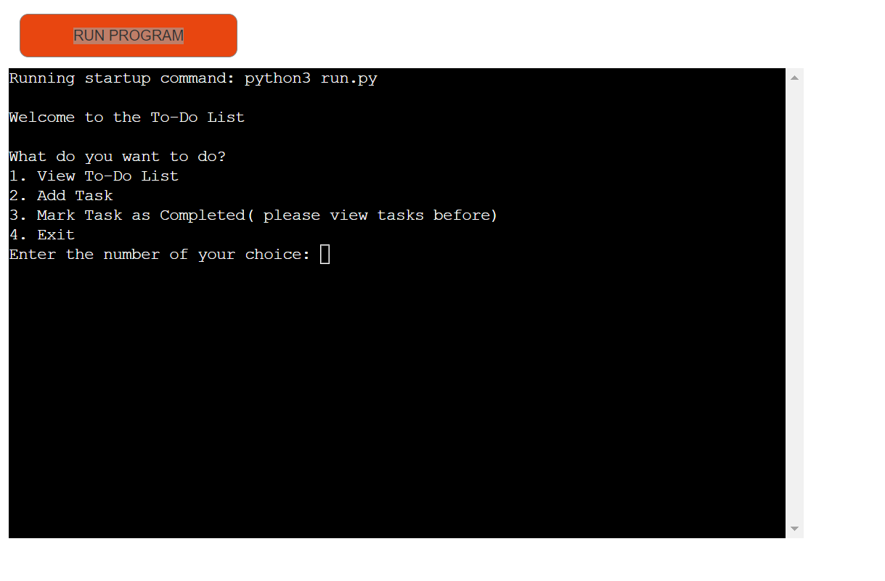

# The To-Do List

# CONTENTS

* [USER EXPERIENCE](#USEREXPERIENCE)
* [Features](#Features)
* [Technolgy used ](#Technolgyused)
* [Testing](#Testing)
	* [Code valadation ](#Codevaladation)
	* [Issues I ran into ](#Issuesiraninto)
	* [Lighthouse](#Lighthouse)
    * [Deployment](#Deployment)
* [Crediations and citataions](#Crediationsandcitataions)
	* [Images](#Images)
	* [Code used](#Codeused)
* [Acknowledgments](#Acknowledgments)

---

# USER EXPERIENCE

## Initial Discussion
To build a functining python app using the CRUD method

## Features
1. Main page where the app is hosted 

# Technology Used

# Testing
| User interaction | Does the function work as intended? (Yes/No) | Why? |
|:---:|:---:|---|
| User clicks on "click me to start the game" | Yes | |
| Alert box picks name | Yes | |
| Level selection loads | Yes | |
| User can pick any level | Yes | |
| Quiz for that level loads | Yes | |
| Score is added up | Yes | |
| Final score is shown with correct message | Yes | |
| Try again button works | Yes | |

# js logic flow chart 

## Code Validation

My JS was validated and corrected at some points by JSHint:

My CSS was checked by W3C Validator along with my HTML:

## Issues I Ran Into
From the start, I had issues with this project and a lot of imposter syndrome.

1. Writer's Block and Imposter Syndrome: Experienced periods of writer's block and imposter syndrome, making it challenging to progress with the project.
2. Understanding Redefining JavaScript Variables and Functions: Struggled with comprehending the concept of redeclaring JavaScript variables and functions and properly calling them in the code.
3. Syntax Errors and Indexing: Faced difficulties in dealing with syntax errors and understanding how to properly index arrays or objects in JavaScript.
4. User Inputs: Encountered issues related to handling user inputs and incorporating them into the application's functionality.
5. Difference Between innerHTML, innerText, and .value: Confusion regarding the distinctions between innerHTML, innerText, and .value when manipulating and retrieving content from HTML elements.
6. Logic Flow: Experienced challenges in designing and implementing a logical flow within the application, leading to issues with program behavior and expected outcomes.
7. iOS: iOS gave me massive issues with my hover effects, and after talking with an experienced developer at Auxfuse, he guided me in the right direction.

These are the issues that were encountered during the development process. Each of them presented unique challenges, requiring time and effort to resolve and overcome.

## Lighthouse

## Deployment
1. Create a Repository: Start by creating a new repository on GitHub. Click on the "New" button on your GitHub profile page or navigate to your organization's repository page. Give your repository a name and make sure it's set to public.
2. Add Files to the Repository: Add your website files to the repository. You can either initialize the repository with a README file or manually upload your HTML, CSS, JavaScript, and other necessary files. Ensure that your main HTML file is named index.html.
3. Enable GitHub Pages: On your repository page, navigate to the "Settings" tab. Scroll down to the "GitHub Pages" section. Under "Source," select the branch you want to deploy. If your site is in the root directory, choose the main branch. If your site is in a specific folder, choose the main branch and specify the folder path. Click on the "Save" button.
4. Verify Deployment: After saving, GitHub Pages will provide you with a link to your deployed site. It might take a few minutes for the deployment to complete. Visit the provided link to verify that your site is deployed correctly.
5. Custom Domain (Optional): If you want to use a custom domain for your GitHub Pages site, you can set it up in the "Custom Domain" section of your repository's "Settings" tab. Follow the instructions provided by GitHub to configure your custom domain.
6. Update and Redeploy: Whenever you make changes to your website files, commit and push them to the repository. GitHub Pages will automatically redeploy the updated site. Ensure that your changes are pushed to the correct branch specified in the GitHub Pages settings.

# Credits and Citations
1. All code used is my own, except for the questions section which I got ChatGPT to assemble, and I added it in the JavaScript elements.
2. Auxfuse: A developer friend who helped me figure out the iOS hover issues.
3. Background image was sourced from [Starry Sky Vectors by Vecteezy](https://www.vecteezy.com/free-vector/starry-sky).
4. Carl, Alan, and my class were always on hand to help.

## Code Used
All the code I used is my own.

## Content
The content is from ChatGPT.

## Acknowledgments
I would like to thank my mentor (okwudiri_mentor), my class, and Alan, my cohort facilitator, for helping with this project.

# Thank You!

