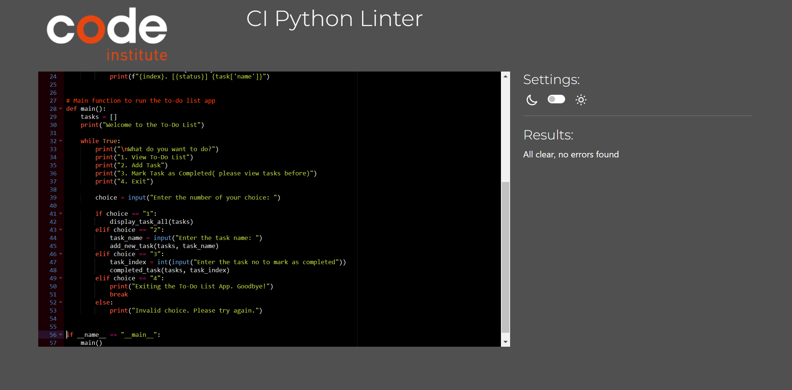

# The To-Do List -

[live site](https://to-do-list-55-620180b59e48.herokuapp.com/
)
# CONTENTS

* [USER EXPERIENCE](#USEREXPERIENCE)
* [Features](#Features)
* [Technolgy used ](#Technolgyused)
* [Testing](#Testing)
	* [Code valadation ](#Codevaladation)
    * [Deployment](#Deployment)
* [Crediations and citataions](#Crediationsandcitataions)

---

# USER EXPERIENCE

## Initial Discussion
To build a functining python app using the CRUD method

## Features
1. Main page where the app is hosted 

# Technology Used
1. This was built using the ci pythin tmeplate and my own pythin code
# Testing
| User interaction | Does the function work as intended? (Yes/No) | Why? |
|:---:|:---:|---|
| user runs program | Yes | |
| handles incorect inputs | Yes | |
| delete and add works | Yes | |
| User can pick any level | Yes | |
| user can see active list| Yes | |

## Code Validation

My python was validated and corrected at some points by ci pythin linter

## Deployment
In hekoru

"Create new App"

give it a name and region

Click on "Create App"

Click on "Settings" on your new App Dashboard
insert below

KEY: PORT and VALUE: 8000 
and dreds if you are using creds

Press Add-button

add in required buildpacks

deploy maunal or auto

# Credits and Citations
1. All code used is my own,

## Code Used
All the code I used is my own.

# Post 

during the period of this part of the course i had to take a leave and get an extesion of the deadline, This is by no way my finsest work and given a lot more time there is so much more i would do, 

I used what i knew in python and kept it simply to be able to complete the project in the time i had left, 

